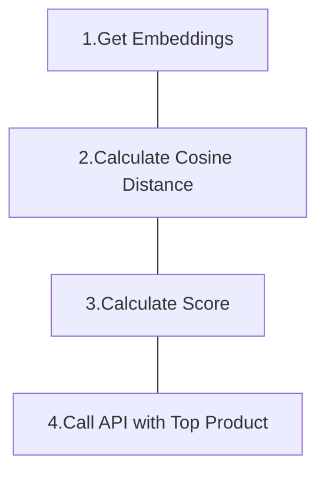

This project is an frontend for Patent Infringement Check App, based on NextJS + Zustand.

Use TanStack query to build API controller, like _Get saved analyis_, _Saving current analysis_, _Check infringement_.

Also use [shadcn](https://ui.shadcn.com/) to build pretty components, but this approach is different than traditional, it's more like a script tool, importing other 3rd party packages to generate code, like [radix-ui](https://www.radix-ui.com/), and it also generate components in the src/components/ui folder, it's convenient for a new project.

---

### How to launch

- better launch `patent_check_api` first
- clone this repository
  - `git clone https://github.com/dychendavid/patent_check_app`
- put .env in the folder(below sample)
- startup NextJS
  - `docker compose up -d`
- alternative with `--build` for code/.env updates
  - `docker compose up -d --build`
- test it with Browser Dev Tool for make sure calling right Host
  - `http://{localhost}:3000`

```
# The domain should be public ip, when you build on production
# Ex: NEXT_PUBLIC_API_URL=http://123.456.789:8000
NEXT_PUBLIC_API_URL=http://localhost:8000

```

---

### How to determine which products is the top possibily infringement products?

#### Simple Flow



### Step 1. Get Embeddings

- Pick up columns which most info
  - This case is Project Description, Claim Description
- Retrieve and save the embedding of picked columns by calling Open AI Embedding API

> We should keep all the embedding comes from same source and same version.

> Keep consistency is important than follow latest version.

<br />

### Step 2. Calculate Cosine Distance

- Calculate the cosine distance between vector of Product Description and Claim Description, for finding the association.
  - by using pgvector
- The table rows growth: <br />
  - 1 Company have `N` Products.<br />
  - 1 Product have distances with `M` Claims.
  - So the rows between specific company and specific patent, it will increase `N * M` rows
- The table columns

```python
company_id,      # int
product_id,      # int
product_desc,    # varchar

patent_id,       # int
claim_id,        # int
claim_desc,      # varchar

cosine_distance  # float
```

<br />

### Step 3. Calculate Infringing Possibility Score

- Find a formula to determine Possibility Score
- Smaller distance should be considered strong association, larger distance probably considered low association.

  - Filter out the distances which over threshold, since the association maybe too low and no important value for reference.<br />
  - Add up remaining distances to get a Possibility Score, maybe the future version we can higher the weight of Claims number.
    > Ex: Claim number \* 2 + Sum of distances = Possibility Score

- The table columns

```python
company_id,     # int
product_id,     # int

patent_id,      # int
product_name,   # varchar
product_desc,   # varchar
claim_ids,      # int array
claim_descs,    # varchar array

score           # float
```

<br />

### Step 4. Using LLM to do analyze

Send related info to LLM without our previously calculated distances for get more diversify analysis result, and using Langchain to make sure LLM output format.

<br />
